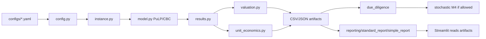

# 01 Repo Architecture Audit

## Estado de Rama

| Campo | Valor |
|---|---|
| Rama de trabajo | `defense-slide-material` |
| Base | `demo-integrated-growth-ui` |
| Motivo | rama más reciente; rama directa no disponible por otro worktree |
| Working tree previo | limpio antes de crear `docs/defense_audit/` |
| Audit docs previos | no presentes como archivos versionados en esta rama; se usaron repo/docs actuales como fuente |

## Mapa Del Repositorio

| Carpeta/archivo | Rol | Estado defensa |
|---|---|---|
| `src/adventure_capital/` | código fuente principal | core |
| `configs/` | instancias YAML y thresholds | core |
| `reports/` | YAML y schemas de reporte | core reporte |
| `docs/adr/` | decisiones técnicas | evidencia metodológica |
| `docs/analysis/` | auditorías/experimentos/benchmarks | evidencia secundaria |
| `tests/` | regresión y smoke tests | evidencia de confiabilidad |
| `outputs/` | instancias/ejecuciones generadas | evidencia demo si se elige run |
| `benchmark_v0/`, `benchmark_v1/` | benchmarks y artefactos históricos | evidencia, no core |
| `legacy/` | notebook Colab original | no presentar como core |
| `app.py`, `streamlit_pages/` | UI Streamlit local | demo/UI |

## Arquitectura Actual

## Superficies de Ejecución

| Superficie | Archivo | Uso |
|---|---|---|
| Python API | `pipeline.run_pipeline()` | notebooks/scripts; no escribe si no hay `output_dir` |
| CLI | `src/adventure_capital/cli.py` | instancias, ejecuciones, reportes, calibración |
| UI | `app.py` | gestor de instancias/ejecuciones y exploración de artefactos |

## Wording Seguro

“La arquitectura actual es un pipeline local reproducible y auditable, con UI Streamlit sobre artefactos. No es una plataforma SaaS productiva todavía.”

## Estado De Auditoría Arquitectura Previa

El brief mencionaba `docs/architecture/*` y `diagrams/architecture_mermaid.md`, pero en la rama latest auditada no aparecen como archivos versionados. No se asumieron como autoridad. Esta carpeta `docs/defense_audit/` reconstruye el material desde el estado actual de `src/`, `docs/`, `configs/`, `tests/`, `app.py`, `streamlit_pages/`, `outputs/` y ADRs.
