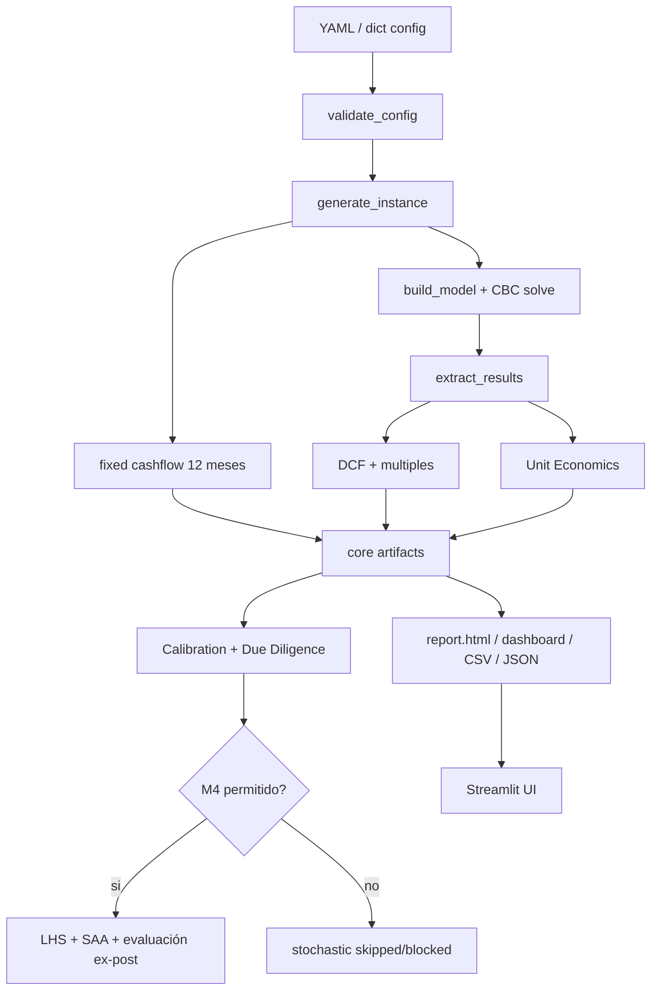

# 02 Pipeline Audit

## Flujo End-To-End

## Contrato Por Etapa

| Etapa | Input | Proceso | Output | Evidencia |
|---|---|---|---|---|
| Config | YAML/dict | carga y validación | config validado | `src/adventure_capital/config.py` |
| Instancia | config | cohortes, churn, descuento, canales, growth constraints | instance dict | `src/adventure_capital/instance.py` |
| Cashflow fijo | instance | meses 1-12 desde `A_base` | `fixed_cashflow` | `src/adventure_capital/financial_model.py` |
| MILP | instance | restricciones + objetivo EBITDA descontado | PuLP solution | `src/adventure_capital/model.py` |
| Resultados | solution | variables -> DataFrame mensual | `optimized_results.csv` | `src/adventure_capital/results.py` |
| Valorización | results | DCF, residual, múltiplos | `valuation_summary.json` | `src/adventure_capital/valuation.py` |
| Unit economics | results | CAC/LTV/etc. | `unit_economics.csv` | `src/adventure_capital/unit_economics.py` |
| DD | artifacts | reglas + calibración | `due_diligence_report.*` | `src/adventure_capital/due_diligence/` |
| M4 | config + DD | escenarios LHS/SAA/evaluación | stochastic artifacts | `src/adventure_capital/stochastic/` |
| Reporte | artifacts + document YAML | Jinja/HTML/PDF opcional | `report.html` | `standard_report/`, `simple_report.py` |

## Separación Implementado/Planeado

- Implementado: pipeline determinista, artefactos, DD, M4 técnico, UI local.
- Parcial/experimental: `DD18` conservative diagnostic, `hiring` como sensibilidad, M4 como soporte a decisión.
- Futuro: SaaS, jobs async, DB, auth, comparables de mercado calibrados.

