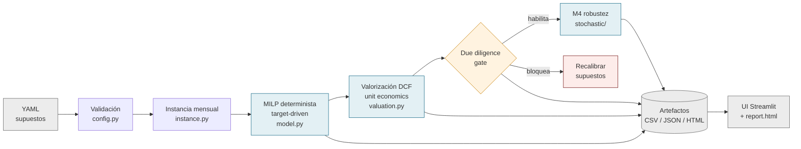
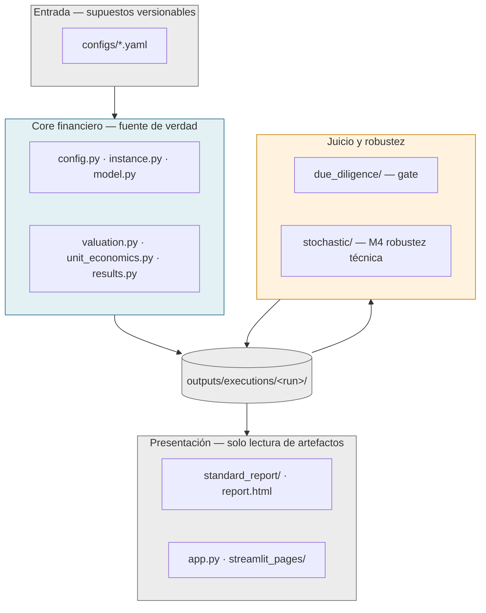
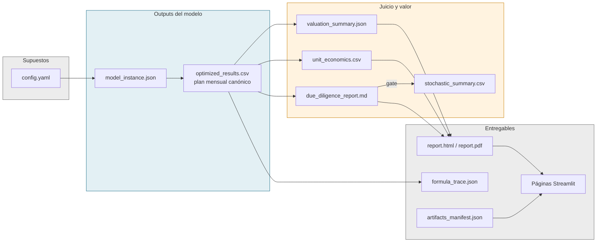
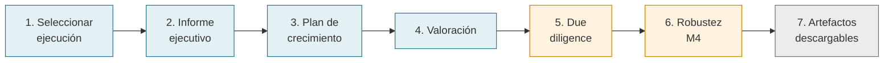
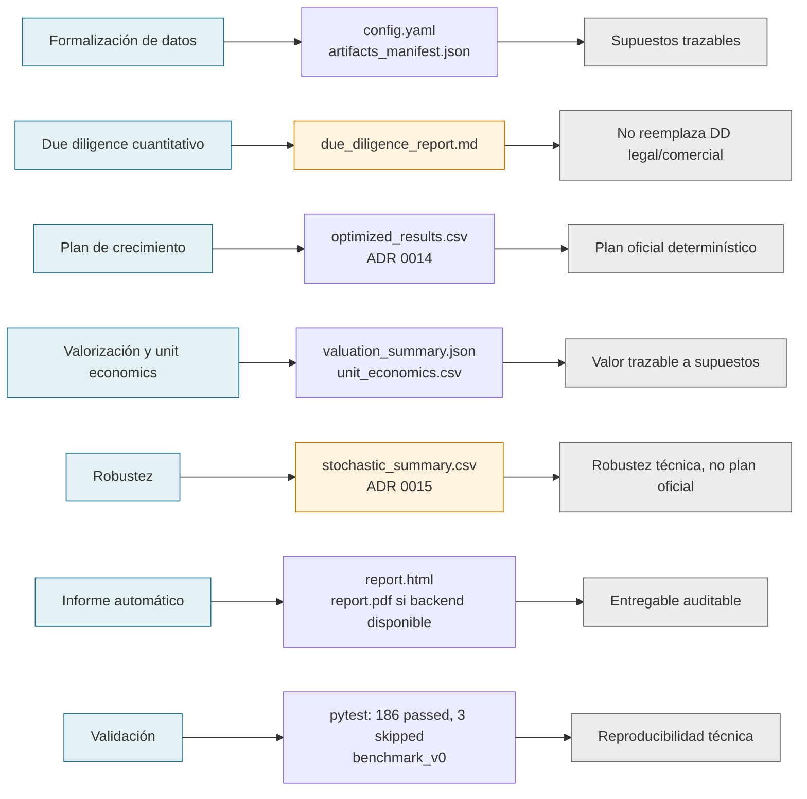

# FINAL DIAGRAMS — Defensa Adventure Capital

Mermaid limpio, convertible a PPT (formas simples, sin estilos exóticos). Colores según gramática visual del deck: azul/teal = sistema, ámbar/rojo = gates/riesgo, gris = artefactos, verde = evidencia validada.

Para renderizar a PNG/SVG (requiere `mmdc`, no instalado hoy):
```bash
npx -y @mermaid-js/mermaid-cli -i docs/defense_audit/FINAL_DIAGRAMS.md -o docs/defense_audit/diagrams/
```

---

## Diagrama 1 — Flujo metodológico (Slide 5)



**Nota PPT:** en PowerPoint dibujar como pipeline horizontal de 9 nodos; DD como rombo ámbar; artefactos como cilindro gris.

---

## Diagrama 2 — Arquitectura modular en capas (Slide 7)



**Nota PPT:** cuatro bandas horizontales; flechas unidireccionales; texto clave "la UI no recalcula" junto a la banda de presentación.

---

## Diagrama 3 — Mapa input → output de artefactos (Slide 8)



**Nota PPT:** tres/cuatro columnas con nombres de archivo reales en tipografía mono; flechas rectas.

---

## Diagrama 4 — Demo path en UI (Slide 12)



**Nota PPT:** cinta horizontal de 7 pasos bajo el screenshot de UI; paso activo resaltado durante la demo.

---

## Diagrama 5 — Objetivo → evidencia → lectura defendible (Slide 6)



**Nota PPT:** si el diagrama queda denso, convertirlo a tabla nativa 7 filas × 4 columnas. La tabla debe conservar los mismos artefactos y lecturas.

| Objetivo | Evidencia | Artefacto | Lectura defendible |
|---|---|---|---|
| Formalización de datos | YAML/configuración estándar | `config.yaml`, `artifacts_manifest.json` | Supuestos trazables |
| Due diligence cuantitativo | Gate financiero/metodológico | `due_diligence_report.md` | No reemplaza DD legal/comercial |
| Plan de crecimiento | Target-driven growth (ADR 0014) | `optimized_results.csv` | Plan oficial determinístico |
| Valorización/unit economics | DCF + métricas unitarias | `valuation_summary.json`, `unit_economics.csv` | Valorización trazable a supuestos |
| Robustez | M4 / escenarios (ADR 0015) | `stochastic_summary.csv` o evidencia de bloqueo DD | Robustez técnica, no plan oficial |
| Informe automático | Reporte HTML/PDF | `report.html` (`report.pdf` si WeasyPrint) | Entregable auditable y descargable |
| Validación | Tests + benchmark | `pytest`: 186 passed, 3 skipped; `benchmark_v0` | Reproducibilidad técnica |

**Nota PPT:** columna "Lectura defendible" en gris; sin checks verdes salvo evidencia ejecutada (tests, corridas existentes).
